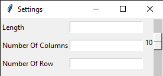
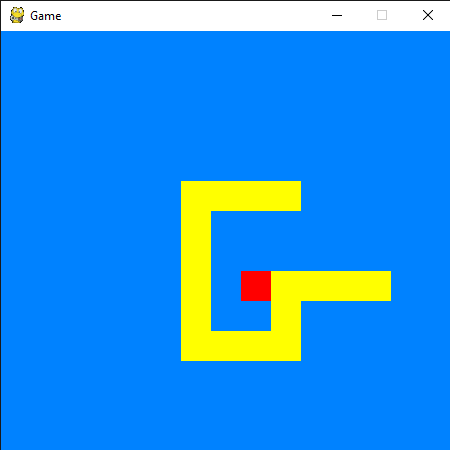

# Snake Game

A sample of old snake game.

About the code:

- At the beginning tab, you can simply select the options that changes the look of the game. But it's not that user friendly since if you leave some of the entries blank, the game will crash. 

- If you wanna play with the default options, just close the first tab.

- If you remove the comment line marks (', # etc.), there'll be a second snake. Which is not really necessary and doesn't fit the entire game since I didn't spare my time on this code, but it's a bit fun.

